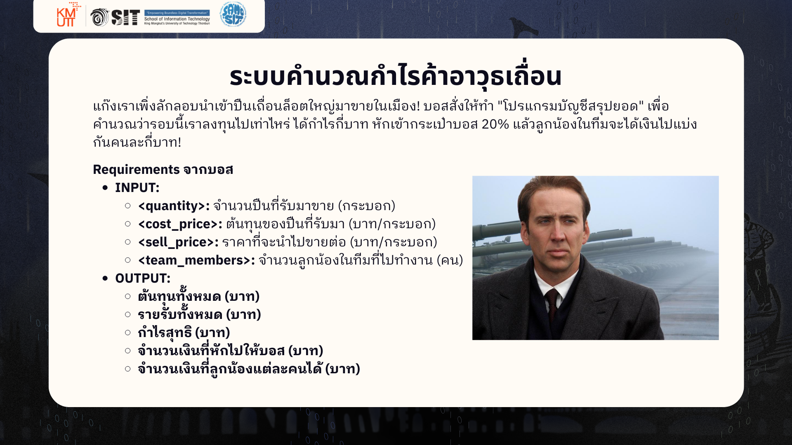
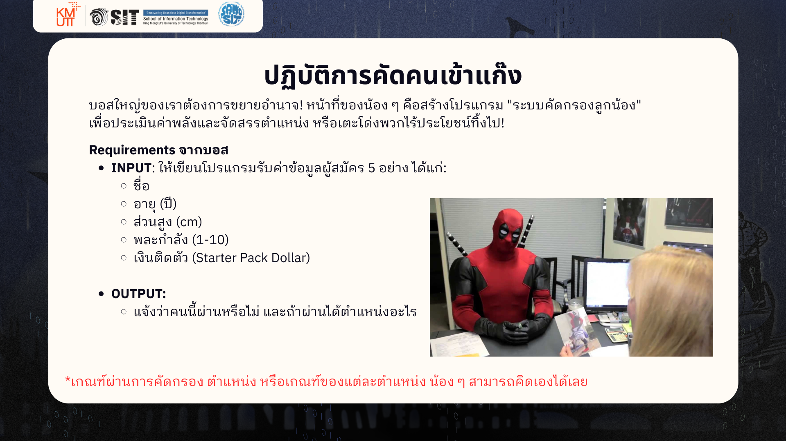

# IT Starter Pack #32 / Basic Programming Workshop 2

##  Instructions

1. Fork repo นี้ไปเป็นของตัวเอง
2. Clone repo ลงเครื่องของน้อง
2. เปิด Repo นั้นใน VS Code
3. สร้างไฟล์ใหม่ขึ้นมา (นามสกุล `.py`) แล้วทำตามโจทย์ได้เลย
4. ทำเสร็จ ใช้ GitHub Workflows (`add`, `commit`, `push`) เพื่ออัปโหลดงานของตัวเองขึ้น Remote repo
5. ส่งลิงก์ Repo ของน้องเข้า Microsoft Teams แล้วพี่ ๆ จะเข้าไป comment งานของน้อง

---

## Workshop Task A

> แก๊งเราเพิ่งลักลอบนำเข้าปืนเถื่อนล็อตใหญ่มาขายในเมือง! บอสสั่งให้ทำ "โปรแกรมบัญชีสรุปยอด" เพื่อคำนวณว่ารอบนี้เราลงทุนไปเท่าไหร่ ได้กำไรกี่บาท หักเข้ากระเป๋าบอส 20% แล้วลูกน้องในทีมจะได้เงินไปแบ่งกันคนละกี่บาท!

### Requirements จากบอส

1. **INPUT**
    - `quantity`: จำนวนปืนที่รับมาขาย (กระบอก)
    - `cost_price`: ต้นทุนของปืนที่รับมา (บาท/กระบอก)
    - `sell_price`: ราคาที่จะนำไปขายต่อ (บาท/กระบอก)
    - `team_members`: จำนวนลูกน้องในทีมที่ไปทำงาน (คน)
2. **OUTPUT**
    - ต้นทุนทั้งหมด (บาท)
    - รายรับทั้งหมด (บาท)
    - กำไรสุทธิ (บาท)
    - จำนวนเงินที่หักไปให้บอส (บาท)
    - จำนวนเงินที่ลูกน้องแต่ละคนได้ (บาท)

---

## Workshop Task B

> บอสใหญ่ของเราต้องการขยายอำนาจ! หน้าที่ของน้อง ๆ คือสร้างโปรแกรม "ระบบคัดกรองลูกน้อง" เพื่อประเมินค่าพลังและจัดสรรตำแหน่ง หรือเตะโด่งพวกไร้ประโยชน์ทิ้งไป!

### Requirements จากบอส

1. **INPUT**
    - ชื่อ
    - อายุ (ปี)
    - ส่วนสูง (cm)
    - พละกำลัง (1-10)
    - เงินติดตัว (Starter Pack Dollar)
2. **OUTPUT**
    - แจ้งว่าคนนี้ผ่านหรือไม่ และถ้าผ่านได้ตำแหน่งอะไร

> [!NOTE]
> เกณฑ์ผ่านการคัดกรอง ตำแหน่ง หรือเกณฑ์ของแต่ละตำแหน่ง น้อง ๆ สามารถคิดเองได้เลย
